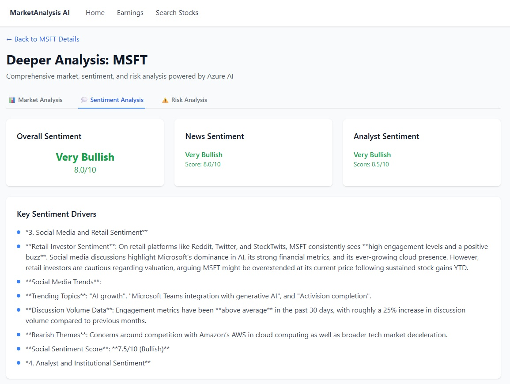

# FinApp AI - Financial Analysis Application

A Next.js application that provides financial market analysis, stock information, and AI-powered insights using Azure AI Foundry.

## Features

- 📈 Real-time stock market data and charts
- 📰 Financial news analysis with AI grounding
- 🤖 AI-powered stock Q&A using Azure AI Foundry
- 📊 Earnings data and financial metrics
- 🎯 Market overview and key statistics
- 🔍 **Deeper Analysis** - Comprehensive AI-powered stock analysis with Market Analysis, Sentiment Analysis, and Risk Analysis

## Screenshots

### Deeper Analysis Feature


*The Deeper Analysis feature provides comprehensive AI-powered analysis including Market Analysis, Sentiment Analysis, and Risk Analysis for any stock.*

## Documentation

- 📋 **[Deeper Analysis Feature Guide](./DEEPER_ANALYSIS_README.md)** - Complete documentation for the AI-powered analysis features

## Setup

1. **Install dependencies:**
   ```bash
   npm install
   ```

2. **Environment Configuration:**
   - Copy `.env.example` to `.env.local`
   - Fill in your API keys and endpoints:
     ```bash
     cp .env.example .env.local
     ```

3. **Required API Keys:**
   - **Azure AI Foundry**: For AI-powered analysis
   - **Alpha Vantage**: For stock market data
   - **Polygon.io**: For additional financial data  
   - **Bing Search**: For news grounding

4. **Run the development server:**
   ```bash
   npm run dev
   ```

5. **Backend (Python):**
   ```bash
   cd python-backend
   pip install -r requirements.txt
   python main.py
   ```

## Project Structure

- `/src/pages` - Next.js pages and API routes
- `/src/components` - React components for UI
- `/src/lib` - Utility functions and configurations
- `/python-backend` - Python backend for AI agents
- `/agents` - TypeScript AI agent implementations

## Environment Variables

See `.env.example` for all required environment variables.

## Development

This project uses:
- **Next.js 13+** with App Router
- **TypeScript** for type safety
- **Tailwind CSS** for styling
- **Chart.js** for data visualization
- **Azure AI Foundry** for AI capabilities

## License

MIT
